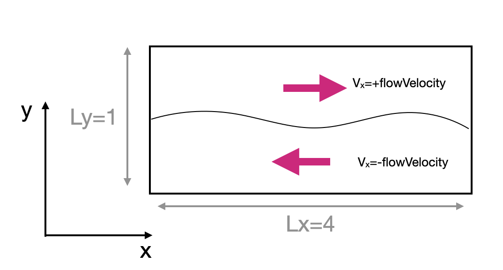

# The 3 main idefix files

Every idefix setup is divided into 3 files: definitions.hpp, idefix.ini and setup.cpp.  Let's see what contains each file:

- definitions.hpp contains preprocessor directives describing the number of dimensions, the equation of state and the geometry of the problem. Any modification of this file requires a recompilation. [More about definitions.hpp](https://idefix.readthedocs.io/latest/reference/definitions.hpp.html) 
- idefix.ini contains parameters read at *runtime* by idefix. It contains directives organized by blocks [...]. Notably, the domain size, resolution (in the [Grid] block), the Hydro solver, the time integrator, the boundary conditions, etc. There is no need to recompile if you change this file. [More about idefix.ini](https://idefix.readthedocs.io/latest/reference/idefix.ini.html).
- setup.cpp contains the C++ code specific to your setup. At minimum it should contain a Setup constructor and a method to initialise the flow. [More about setup.cpp](https://idefix.readthedocs.io/latest/reference/setup.cpp.html)

# About this problem

This problems proposes to set up a simple Kelvin Helmholtz instability flow that consist of two layers of fluid moving in opposite directions.

 
 

The interface is designed with a weak initial perturbation that will grow because of the Kelvin-Hemholtz instability. We will assume the flow is periodic in $x$ and we will use outflow (i.e. non-reflective) boundary conditions in the $y$ and $z$ direction.

In this problem, we have left some holes that you will have to fill with the documentation. These are identified by `## TBF ##` or `//TBF// in the source code.

# Your work
## Define the boundary conditions

In this setup, we want periodic boundary conditions in the $x$ direction, and outflow boundary conditions in the $y$ and $z$ directions. Edit `idefix.ini` to define your boundary conditions. The [documentation](https://idefix.readthedocs.io/latest/reference/idefix.ini.html#boundary-section) might be handy! 

## Read the flow velocity from idefix.ini

In this setup, we want to vary the flow velocity without recompiling the code. Idefix allows you to define as many blocks and parameters as you wish. Here, we have defined a block `[Setup]` with our parameter `flowVelocity`. We should now fetch this parameter in our `setup.cpp` code.

This is typically done in the setup constructor (`Setup::Setup` in setup.cpp), using the `Get` method that belongs to the `Input` class. Have a look at the [example](https://idefix.readthedocs.io/latest/reference/setup.cpp.html#example) provided in the user guide, and at the [documentation of the `Input::Get` method](https://idefix.readthedocs.io/latest/programmingguide.html#the-input-class) in the programming guide.

## Define your initial conditions

Our last task is to define our initial conditions. This is done in the `Setup::InitFlow` method. We have already
prepared a loop on the domain for you, so you just have to fill the holes, knowing that $v_x=$ flowVelocity when $y\gt y_{\rm interface}$ and $v_x=-$ flowVelocity when $y\lt y_{\rm interface}$. Here again, the [documentation](https://idefix.readthedocs.io/latest/reference/setup.cpp.html#setup-initflow-method) might help. 

## Configure the code, build and run it

Follow the instruction in the [Getting Started](../GettingStarted/README.md#compile-an-example) section. 

## Check the outputs

To visualize the flow, you may use Paraview or visit to open the files generated by Idefix. If you're not familiar with these tools, you can use the provided simple reader `read_problem.py` (this only requires matplotlib, numpy and the python tools bundled with the Idefix repository). For instance, to open the solution at $t=5.0$ (file numbered 5)

```shell
python3 read_problem.py 5
```

Note that a new vtk file is produced every $\Delta t=1.0$ (in code units), so you can easily see how the flow evolves with time. You should see a nice vortex alley developping in the simulation, particularly visible in the vertical vorticity $\omega_z=\partial_x v_y-\partial_y v_x$ field.


## Play with your setup

Now, you can increase (without recompiling!) the flow speed beyond the sound speed (here =1.0 in the setup)
to see the effect on compressibility. You can also try to use [parallelism with MPI](../GettingStarted/README.md#run-in-parallel-with-mpi) to speed up the computation
